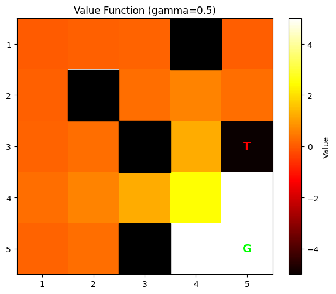
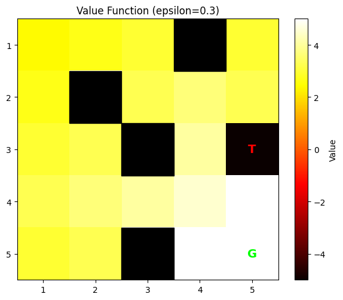
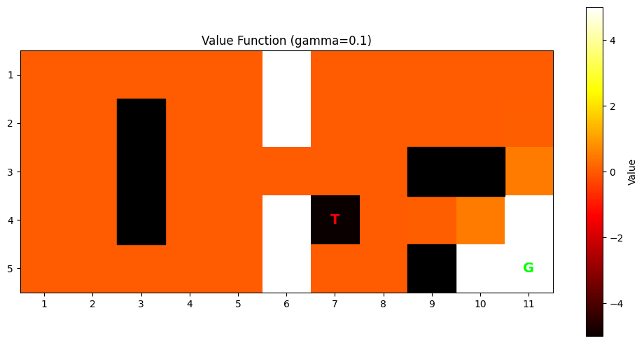
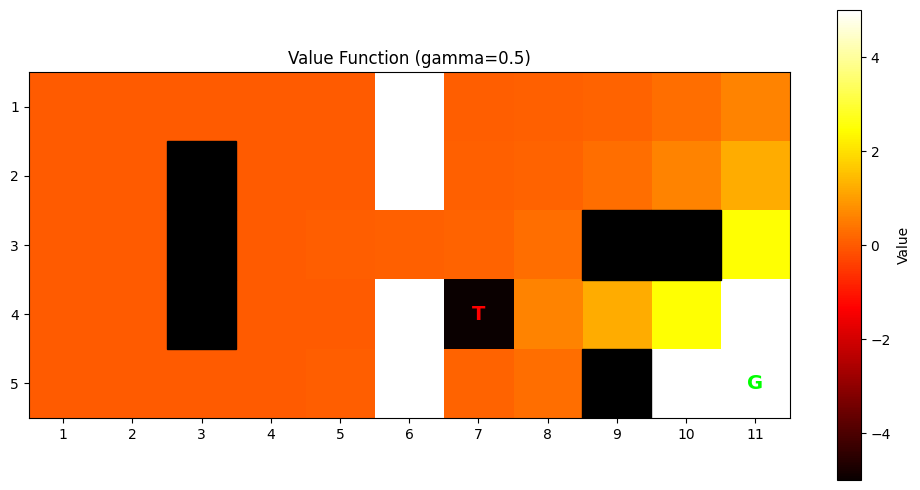
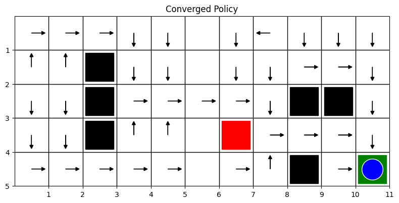
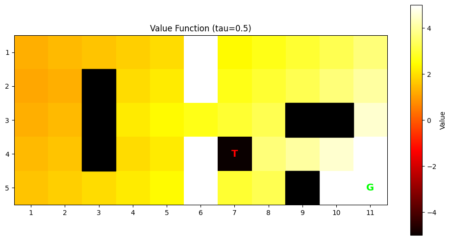
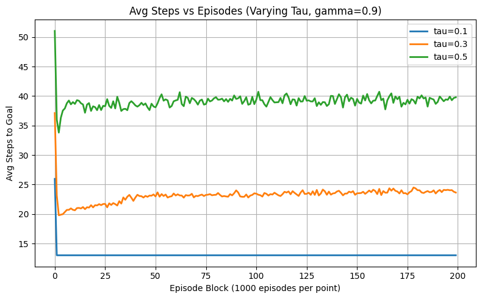

# GridWorld – Q-Learning Report

## Author: Satish Jhanwer

---

## Part 1: GridWorld with Epsilon-Greedy Q-Learning

### Part 1: Environment Setup

- Grid size: 5x5
- Start: (1, 1)
- Goal: (5, 5), Reward = **+5**
- Trap: (3, 5), Reward = **–5**
- Obstacles: (1,4), (2,2), (3,3), (5,3)
- Stepping outside the grid yields a reward of –1; all other moves yield 0.
- Learning rate (alpha): **0.1**
- Episodes: **100,000**

---

### Q1: Converged Policy and Value Function

I applied epsilon-greedy Q-learning with:

- Gamma = **0.9**
- Epsilon = **0.2**

**Converged Policy:**

**Value Function:**

#### Part 1: Q1 - **Interpretation:**

- The agent learned an optimal policy, efficiently navigating around obstacles and avoiding the trap.
- High values propagate from the goal, while states near the trap show significantly lower values, reflecting effective risk awareness.
- The results demonstrate efficient convergence through epsilon-greedy updates.

---

### Q2: Varying Discount Factor (Gamma) – Fixed Epsilon = 0.1

- Gamma values tested: 0.1, 0.5, 0.9

#### Part 1: Q2 **Gamma = 0.1**

**Policy:**

**Value Function:**

#### Part 1: Q2 **Gamma = 0.5**

**Policy:**

**Value Function:**

#### Part 1: Q2 **Gamma = 0.9**

**Policy:**

**Value Function:**

**Steps to Goal:**

#### Part 1: Q2 - **Interpretation:**

- With **Gamma = 0.1**, the agent strongly prefers immediate rewards and often ignores the goal's distant reward, resulting in short-sighted and suboptimal paths.
- **Gamma = 0.5** encourages the agent to recognize longer-term rewards, but it still occasionally diverges.
- **Gamma = 0.9** promotes long-term planning, enabling the agent to follow the most optimal and direct paths to the goal.
- The step plot confirms that higher gamma values lead to smoother convergence due to better foresight.

---

### Q3: Varying Epsilon – Fixed Gamma = 0.9

- Epsilon values tested: 0.1, 0.3, 0.5

#### **Epsilon = 0.1**

**Policy:**

**Value Function:**

#### **Epsilon = 0.3**

**Policy:**

**Value Function:**

#### **Epsilon = 0.5**

**Policy:**

**Value Function:**

**Steps to Goal:**

#### Part 1: Q3 - **Interpretation:**

- **Epsilon = 0.1** encourages greedy exploitation, resulting in fast convergence but possibly missing better paths early in learning.
- **Epsilon = 0.3** introduces moderate exploration, allowing the agent to explore alternatives but causing slower convergence.
- **Epsilon = 0.5** increases randomness, which leads to inefficient learning and significantly delayed convergence.
- Lower epsilon values promote stability and help the agent discover the optimal path more quickly, as reflected in fewer average steps per episode.

---

## Part 2: GridWorld with Softmax-Based Q-Learning

### Part 2: Environment Setup

- Grid size: 5x11
- Start: (1, 1)
- Goal: (5, 11), Reward = **+5**
- Trap: (4, 7), Reward = **–5**
- Tunnels: ((3, 5), (3, 6))
- Obstacles: (2,3), (3,3), (4,3), (3,9), (3,10), (5,9)
- Stepping outside the grid yields a reward of –1; all other moves yield 0.
- Learning rate (alpha): **0.1**
- Episodes: **200,000**

---

### Q1: Converged Policy and Value Function (Softmax)

**Parameters:**

- Gamma = 0.9
- Tau (softmax temperature) = 0.1

**Converged Policy:**

**Value Function:**

#### Part 2: Q1 - **Interpretation:**

- Softmax exploration introduces early stochasticity but enables the agent to eventually converge to the optimal path.
- Despite the increased grid complexity, the agent effectively navigates through the bottleneck, avoiding traps and dead-ends.
- The value gradient clearly reflects proximity to the goal.

---

### Q2: Varying Gamma – Fixed Tau = 0.1

- Gamma values tested: 0.1, 0.5, 0.9

#### Part 2: Q2 **Gamma = 0.1**

**Policy:**

**Value Function:**

#### Part 2: Q2 **Gamma = 0.5**

**Policy:**

**Value Function:**

#### Part 2: Q2 **Gamma = 0.9**

**Policy:**

**Value Function:**

**Steps to Goal:**

#### Part 2: Q2 - **Interpretation:**

- With **Gamma = 0.1**, the agent behaves short-sightly and struggles with the bottleneck corridor.
- **Gamma = 0.5** improves navigation, but some indecisiveness remains.
- **Gamma = 0.9** enables the agent to learn an optimal long-horizon policy and consistently avoid traps.
- The plot shows a steady reduction in average steps as gamma increases.

---

### Q3: Varying Tau – Fixed Gamma = 0.9

- Tau values tested: 0.1, 0.3, 0.5

#### **Tau = 0.1**

**Policy:**

**Value Function:**

#### **Tau = 0.3**

**Policy:**

**Value Function:**

#### **Tau = 0.5**

**Policy:**

**Value Function:**

**Steps to Goal:**

#### Part 2: Q3 - **Interpretation:**

- **Tau = 0.1** produces near-deterministic softmax decisions, allowing efficient convergence and high policy quality.
- **Tau = 0.3** balances exploration and exploitation, resulting in moderate performance.
- **Tau = 0.5** makes the policy overly exploratory, flattening action selection probabilities and degrading performance.
- Increasing tau causes the agent to act too randomly, which hampers learning stability.

---

## Conclusion

- Both epsilon-greedy and softmax Q-learning methods perform effectively under suitable configurations.
- Low epsilon or tau values accelerate convergence but may cause premature exploitation.
- High gamma values consistently improve value propagation and path optimality.
- The grid's complexity and layout influence the ideal parameter settings.

---

## Appendix

- I structured all code to be modular and reusable.
- I generated visualizations using matplotlib.
- I ran experiments using Python 3.12.3, NumPy, and Matplotlib.
- I performed all experiments on a personal workstation (no GPU).
- I smoothed graphs using 1000-episode windows for clearer trends.
- All scripts are parameterized for easy testing with different grid setups.
